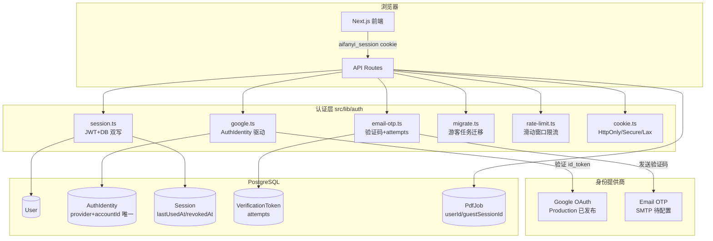
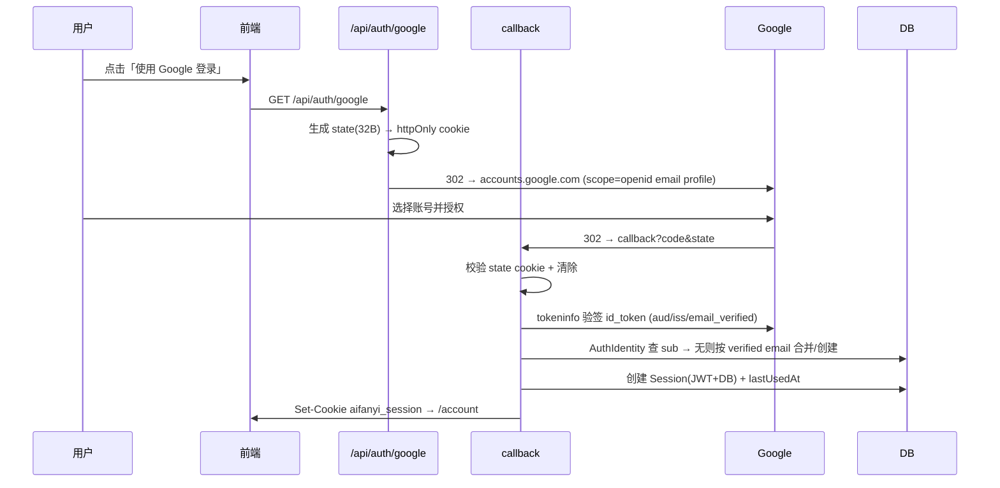
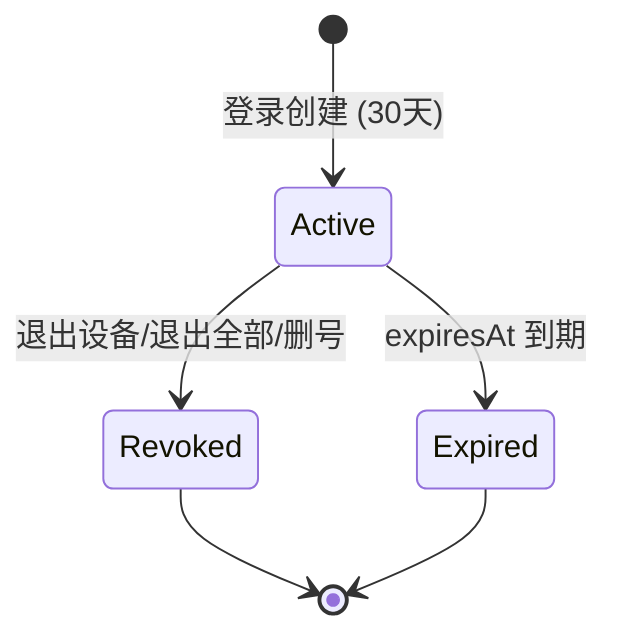

# 02 · 认证架构图

## 系统架构

```mermaid
flowchart TD
    subgraph Client[浏览器]
        A[Next.js 前端] -->|aifanyi_session cookie| B[API Routes]
    end

    subgraph Auth[认证层 src/lib/auth]
        S[session.ts<br/>JWT+DB 双写]
        G[google.ts<br/>AuthIdentity 驱动]
        O[email-otp.ts<br/>验证码+attempts]
        M[migrate.ts<br/>游客任务迁移]
        R[rate-limit.ts<br/>滑动窗口限流]
        C[cookie.ts<br/>HttpOnly/Secure/Lax]
    end

    subgraph Providers[身份提供商]
        GGL[Google OAuth<br/>Production 已发布]
        EML[Email OTP<br/>SMTP 待配置]
    end

    subgraph DB[PostgreSQL]
        U[(User)]
        AI[(AuthIdentity<br/>provider+accountId 唯一)]
        SE[(Session<br/>lastUsedAt/revokedAt)]
        VT[(VerificationToken<br/>attempts)]
        PJ[(PdfJob<br/>userId/guestSessionId)]
    end

    B --> S
    B --> G
    B --> O
    B --> M
    B --> R
    B --> C
    G -->|验证 id_token| GGL
    O -->|发送验证码| EML
    S --> U
    G --> AI
    S --> SE
    O --> VT
    B --> PJ
```

## 登录流程（Google）

```mermaid
sequenceDiagram
    participant U as 用户
    participant F as 前端
    participant R as /api/auth/google
    participant CB as callback
    participant G as Google
    participant D as DB

    U->>F: 点击「使用 Google 登录」
    F->>R: GET /api/auth/google
    R->>R: 生成 state(32B) → httpOnly cookie
    R->>G: 302 → accounts.google.com (scope=openid email profile)
    U->>G: 选择账号并授权
    G->>CB: 302 → callback?code&state
    CB->>CB: 校验 state cookie + 清除
    CB->>G: tokeninfo 验签 id_token (aud/iss/email_verified)
    CB->>D: AuthIdentity 查 sub → 无则按 verified email 合并/创建
    CB->>D: 创建 Session(JWT+DB) + lastUsedAt
    CB->>F: Set-Cookie aifanyi_session → /account
```

## 会话生命周期

```mermaid
stateDiagram-v2
    [*] --> Active: 登录创建 (30天)
    Active --> Expired: expiresAt 到期
    Active --> Revoked: 退出设备/退出全部/删号
    Revoked --> [*]
    Expired --> [*]
```
